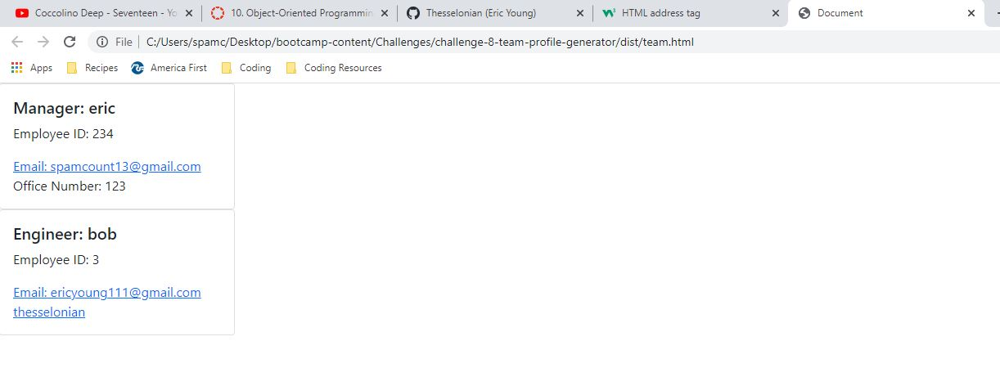

# team-profile-generator

## Description

Generates an interactive HTML document based on command line user input

## Installation

Install dependencies with npm install then run the application using node index.js

## Screenshot of Generated Document

## Link to Video Walk Through

https://watch.screencastify.com/v/FR1Y6E05gb9ZuSghjZDZ

## License

